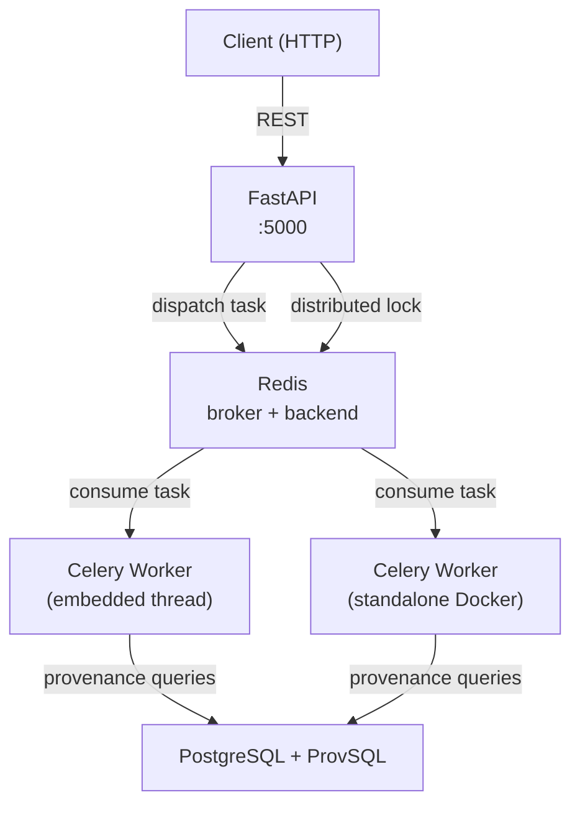

# AP Explanation

[](https://img.shields.io/github/commit-activity/m/datagems-eosc/ap-explanation)
[](https://img.shields.io/github/license/datagems-eosc/ap-explanation)

A FastAPI service that explains **where SQL query results come from**, using [ProvSQL](https://github.com/PierreSenellart/provsql) to track data lineage through joins, aggregations, and transformations.

Given a query, the service returns:
- **Formula semiring** — how results were computed: `(students₁ ⊗ grades₂) ⊕ students₃`
- **Why semiring** — which source rows contributed: `["students(1)", "grades(2)"]`

> Full documentation: **https://datagems-eosc.github.io/ap-explanation/**

---

## Architecture



By default, the FastAPI process starts an **embedded Celery worker** in a daemon thread — no separate process required. For production scale-out, additional standalone workers can be launched independently (see below).

---

## Environment Variables

Copy `.env.example` to `.env` and fill in the values.

| Variable | Required | Default | Description |
|---|---|---|---|
| `REDIS_BROKER_URI` | No | `redis://redis:6379/0` | Redis URL used as Celery broker and result backend |
| `USE_EMBEDDED_CELERY_WORKER` | No | `true` | Start a Celery worker inside the FastAPI process. Set to `false` when using standalone workers |
| `POSTGRES_USER` | Yes | — | PostgreSQL username |
| `POSTGRES_PASSWORD` | Yes | — | PostgreSQL password |
| `POSTGRES_HOST` | Yes | — | Primary PostgreSQL host |
| `POSTGRES_PORT` | No | `5432` | Primary PostgreSQL port |
| `ROOT_PATH` | No | `""` | API root path when behind a reverse proxy |

---

## Quick Start

The repository ships a [Dev Container](https://containers.dev/) that provides Python, Redis, and a ProvSQL-enabled PostgreSQL instance out of the box.

```bash
# 1. Open in VS Code Dev Container (recommended)
#    → or run locally after installing uv

# 2. Install all dependencies (including dev/test groups)
uv sync --all-groups

# 3. Copy and edit environment variables
cp .env.example .env

# 4. Start the service (embedded Celery worker starts automatically)
uv run ap_explanation/main.py
```

The API is then available at `http://localhost:5000`. Interactive docs at `http://localhost:5000/docs`.

### Running a standalone Celery worker

For scale-out or to run the worker separately from the API:

```bash
docker run --rm \
  --env-file .env \
  ap-explanation:prod \
  uv run celery -A ap_explanation.celery_app:celery_app worker --loglevel=info
```

### Running tests

```bash
pytest tests/
```

Tests use `testcontainers` to spin up a PostgreSQL + ProvSQL instance automatically — no manual setup needed.

---

## Documentation

Full documentation (architecture, configuration, API reference, troubleshooting):  
**https://datagems-eosc.github.io/ap-explanation/**
