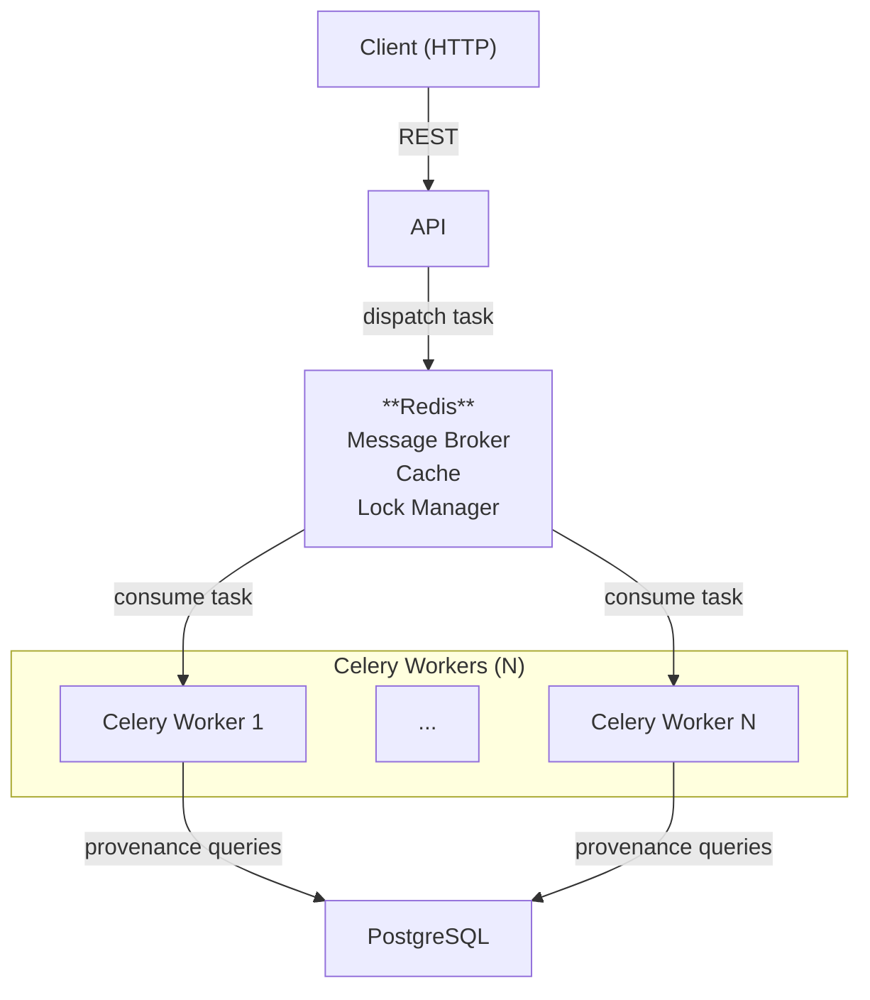
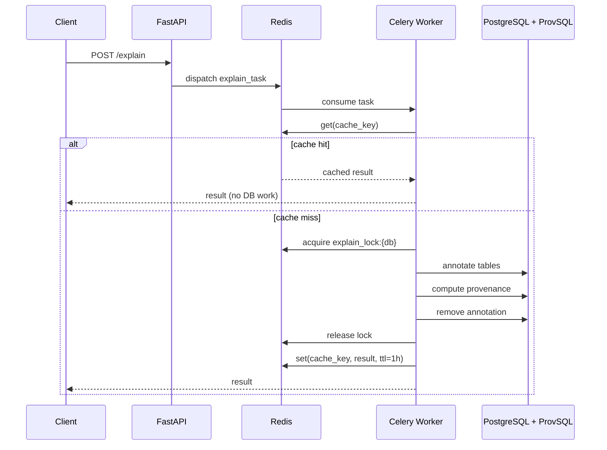

# AP Explanation

[](https://img.shields.io/github/commit-activity/m/datagems-eosc/ap-explanation)
[](https://img.shields.io/github/license/datagems-eosc/ap-explanation)

A FastAPI service that explains **where SQL query results come from**, using [ProvSQL](https://github.com/PierreSenellart/provsql) to track data lineage through joins, aggregations, and transformations.

Given a query, the service returns one or more provenance annotations:

| Semiring | What it captures |
|---|---|
| `formula` | Algebraic expression showing how each result was derived: `(students₁ ⊗ grades₂) ⊕ students₃` |
| `why` | Flat list of source tuples that contributed: `["students(1)", "grades(2)"]` |
| `boolexpr` | Boolean provenance expression over source identifiers |
| `how` | How-provenance: multiset polynomial showing multiplicities |
| `which` | Which-provenance (lineage): set of contributing tuple identifiers |

Each annotation is provided by ProvSQL's built-in `sr_*` semiring functions.

- **Natural-language explanation** (optional, LLM-powered) — a human-readable summary of the provenance

The service supports two data source types, declared in the Analytical Pattern (AP) graph.

### Relational Database

The data node uses the label `Relational_Database` and points to an existing PostgreSQL database via `name`. Tables are listed as child nodes with label `Table`.

```jsonc
// fixtures/explain_sql_query_mathe.json (trimmed)
{
  "id": "...",
  "labels": ["Relational_Database"],
  "properties": {
    "name": "mathe",
  }
}
// child nodes:
{ "labels": ["Table"], "properties": { "name": "mathe.assessment" } }
{ "labels": ["Table"], "properties": { "name": "mathe.platform__topic" } }
```

The service connects directly to the database and runs provenance queries against the existing tables.

### CSV Set

The data node uses the label `CSV_Set`. Individual CSV files are child nodes with label `CSV` and a `contentUrl` referencing an S3 path.

```jsonc
// fixtures/explain_sql_query_csv.json (trimmed)
{
  "id": "...",
  "labels": ["CSV_Set", "Data"],
  "properties": { "delimiter": "," }
}
// child node:
{
  "labels": ["CSV", "Data", "cr:FileObject"],
  "properties": {
    "name": "assessment.csv",
    "contentUrl": "s3:/assessment.csv"
  }
}
```

The service reads the CSV files from `S3_MOUNT_PATH`, loads them into a **temporary PostgreSQL schema**, runs the provenance query, then cleans up.

> Full documentation: **https://datagems-eosc.github.io/ap-explanation/**

---

## Architecture



By default, the FastAPI process starts an **embedded Celery worker** in a daemon thread — no separate process required. For production scale-out, additional standalone workers can be launched independently (see below).

### Async request flow



> See the [architecture docs](https://datagems-eosc.github.io/ap-explanation/architecture/) for a detailed breakdown.

---

## Environment Variables

Copy `.env.example` to `.env` and fill in the values.

### PostgreSQL

| Variable | Required | Default | Description |
|---|---|---|---|
| `POSTGRES_USER` | Yes | — | PostgreSQL username |
| `POSTGRES_PASSWORD` | Yes | — | PostgreSQL password |
| `POSTGRES_HOST` | Yes | — | Primary PostgreSQL host |
| `POSTGRES_PORT` | No | `5432` | Primary PostgreSQL port |
| `POSTGRES_TIMESCALE_HOST` | No | — | Fallback PostgreSQL host (e.g. a Timescale instance). If set, the service retries here when the target database is not found on the primary host |
| `POSTGRES_TIMESCALE_PORT` | No | `5433` | Port for the fallback PostgreSQL host |

### Infrastructure

| Variable | Required | Default | Description |
|---|---|---|---|
| `REDIS_BROKER_URI` | No | `redis://redis:6379/0` | Redis URL used as Celery broker, result backend, cache and distributed lock |
| `USE_EMBEDDED_CELERY_WORKER` | No | `true` | Start a Celery worker inside the FastAPI process. Set to `false` when using standalone workers |
| `S3_MOUNT_PATH` | No | `/mnt/s3` | Local path where CSV source files are mounted (used by the CSV data source) |
| `ROOT_PATH` | No | `""` | API root path when behind a reverse proxy |

### LLM — Natural-language explanations (optional)

When `LLM_API_BASE` is not set, natural-language explanations are silently disabled and the service falls back to returning only the raw semiring result.

| Variable | Required | Default | Description |
|---|---|---|---|
| `LLM_API_BASE` | No | — | Base URL of an OpenAI-compatible LLM API. If omitted, NL explanations are disabled |
| `LLM_API_MODEL` | If `LLM_API_BASE` set | — | Model name to pass to the LLM API (e.g. `gpt-4o`, `mistral-7b`) |
| `LLM_API_KEY` | No | — | API key for the LLM endpoint. Leave empty for unauthenticated / local endpoints |
| `LLM_SSL_VERIFY` | No | `true` | Set to `false` to disable TLS certificate verification for the LLM endpoint (useful for self-hosted models with self-signed certs) |

### Authentication (OIDC)

| Variable | Required | Default | Description |
|---|---|---|---|
| `OIDC_ISSUER` | No | — | OIDC issuer URL (e.g. `https://keycloak.example.com/realms/myrealm`). If not set, authentication is **disabled** and all endpoints are publicly accessible |
| `OIDC_CLIENT_ID` | If `OIDC_ISSUER` set | — | Client ID used to validate the JWT audience and for token exchange |
| `OIDC_CLIENT_SECRET` | If `OIDC_ISSUER` set | — | Client secret used for token exchange |
| `OIDC_EXCHANGE_SCOPE` | If `OIDC_ISSUER` set | — | Scope requested during the token exchange flow |
| `JWKS_TTL_SECONDS` | No | `300` | How long (in seconds) the JWKS public key cache is considered valid before being refreshed |

When `OIDC_ISSUER` is set, every protected endpoint requires a valid `Authorization: Bearer <token>` header. The service:

1. Fetches the JWKS from `{OIDC_ISSUER}/protocol/openid-connect/certs` (cached for `JWKS_TTL_SECONDS`)
2. Validates the token signature (RS256), issuer, and audience
3. Binds `UserId` (`sub`) and `ClientId` (`azp`) from the JWT claims to the structured logs for the request

---

## Quick Start

The repository ships a [Dev Container](https://containers.dev/) that provides Python, Redis, and a ProvSQL-enabled PostgreSQL instance out of the box.

```bash
# 1. Open in VS Code Dev Container (recommended)
#    → or run locally after installing uv

# 2. Install all dependencies (including dev/test groups)
uv sync --all-groups

# 3. Copy and edit environment variables
cp .env.example .env

# 4. Start the service (embedded Celery worker starts automatically)
uv run ap_explanation/main.py
```

The API is then available at `http://localhost:5000`. Interactive docs at `http://localhost:5000/docs`.

### Running a standalone Celery worker

For scale-out or to run the worker separately from the API:

```bash
docker run --rm \
  --env-file .env \
  ap-explanation:prod \
  uv run celery -A ap_explanation.celery_app:celery_app worker --loglevel=info
```

### Running tests

```bash
pytest tests/
```

Tests use `testcontainers` to spin up a PostgreSQL + ProvSQL instance automatically — no manual setup needed.

## Health & Readiness

| Endpoint | Description |
|---|---|
| `GET /api/v1/health` | Liveness check — always returns `{"status": "ok"}` |
| `GET /api/v1/ready` | Readiness check — verifies Redis is reachable (returns 503 if not) |

---

## Documentation

Full documentation (architecture, configuration, API reference, troubleshooting):  
**https://datagems-eosc.github.io/ap-explanation/**
