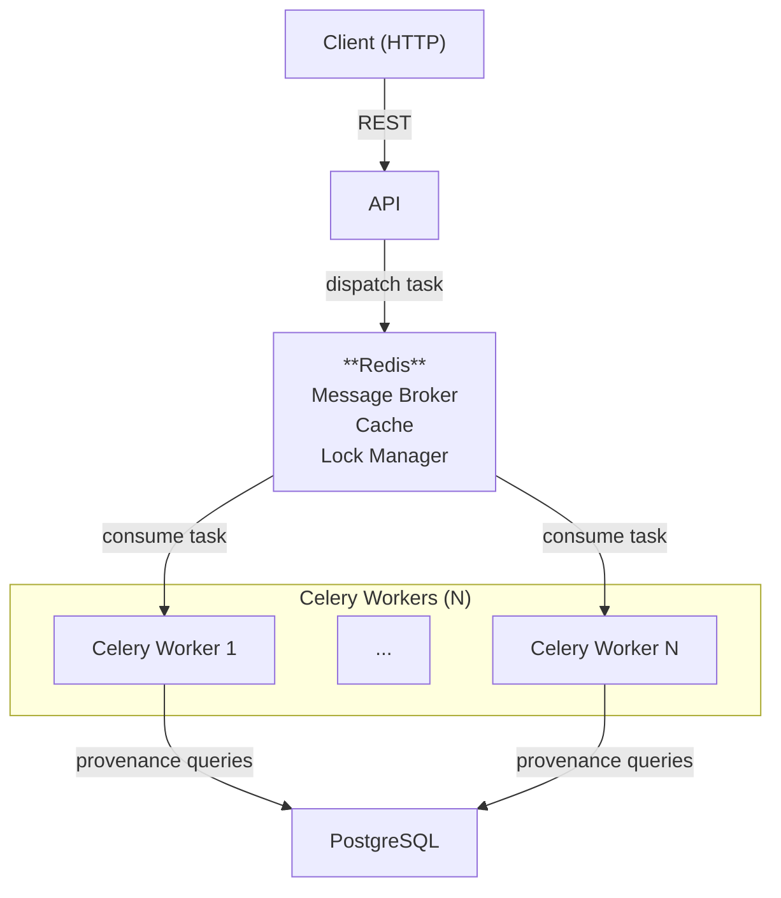
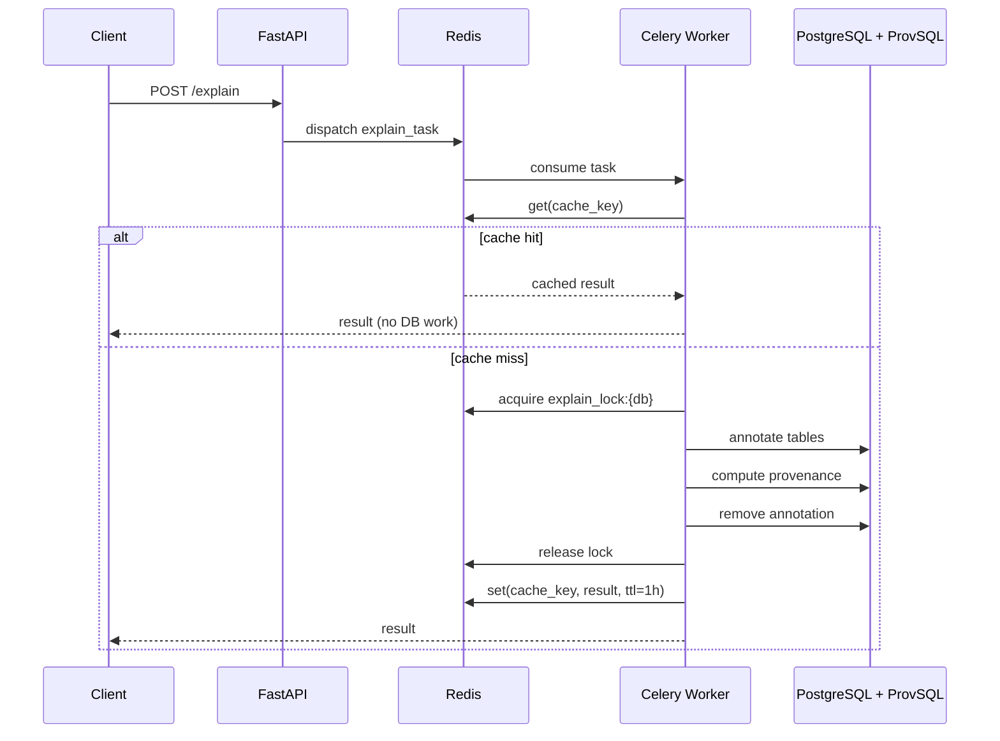

# AP Explanation

[](https://img.shields.io/github/commit-activity/m/datagems-eosc/ap-explanation)
[](https://img.shields.io/github/license/datagems-eosc/ap-explanation)

A FastAPI service that explains **where SQL query results come from**, using [ProvSQL](https://github.com/PierreSenellart/provsql) to track data lineage through joins, aggregations, and transformations.

Given a query, the service returns:
- **Formula semiring** — how results were computed: `(students₁ ⊗ grades₂) ⊕ students₃`
- **Why semiring** — which source rows contributed: `["students(1)", "grades(2)"]`

> Full documentation: **https://datagems-eosc.github.io/ap-explanation/**

---

## Architecture



By default, the FastAPI process starts an **embedded Celery worker** in a daemon thread — no separate process required. For production scale-out, additional standalone workers can be launched independently (see below).

### Async request flow



> See the [architecture docs](https://datagems-eosc.github.io/ap-explanation/architecture/) for a detailed breakdown.

---

## Environment Variables

Copy `.env.example` to `.env` and fill in the values.

### PostgreSQL

| Variable | Required | Default | Description |
|---|---|---|---|
| `POSTGRES_USER` | Yes | — | PostgreSQL username |
| `POSTGRES_PASSWORD` | Yes | — | PostgreSQL password |
| `POSTGRES_HOST` | Yes | — | Primary PostgreSQL host |
| `POSTGRES_PORT` | No | `5432` | Primary PostgreSQL port |
| `POSTGRES_TIMESCALE_HOST` | No | — | Fallback PostgreSQL host (e.g. a Timescale instance). If set, the service retries here when the target database is not found on the primary host |
| `POSTGRES_TIMESCALE_PORT` | No | `5433` | Port for the fallback PostgreSQL host |

### Infrastructure

| Variable | Required | Default | Description |
|---|---|---|---|
| `REDIS_BROKER_URI` | No | `redis://redis:6379/0` | Redis URL used as Celery broker, result backend, cache and distributed lock |
| `USE_EMBEDDED_CELERY_WORKER` | No | `true` | Start a Celery worker inside the FastAPI process. Set to `false` when using standalone workers |
| `ROOT_PATH` | No | `""` | API root path when behind a reverse proxy |

### LLM — Natural-language explanations (optional)

When `LLM_API_BASE` is not set, natural-language explanations are silently disabled and the service falls back to returning only the raw semiring result.

| Variable | Required | Default | Description |
|---|---|---|---|
| `LLM_API_BASE` | No | — | Base URL of an OpenAI-compatible LLM API. If omitted, NL explanations are disabled |
| `LLM_API_MODEL` | If `LLM_API_BASE` set | — | Model name to pass to the LLM API (e.g. `gpt-4o`, `mistral-7b`) |
| `LLM_API_KEY` | No | — | API key for the LLM endpoint. Leave empty for unauthenticated / local endpoints |
| `LLM_SSL_VERIFY` | No | `true` | Set to `false` to disable TLS certificate verification for the LLM endpoint (useful for self-hosted models with self-signed certs) |

---

## Quick Start

The repository ships a [Dev Container](https://containers.dev/) that provides Python, Redis, and a ProvSQL-enabled PostgreSQL instance out of the box.

```bash
# 1. Open in VS Code Dev Container (recommended)
#    → or run locally after installing uv

# 2. Install all dependencies (including dev/test groups)
uv sync --all-groups

# 3. Copy and edit environment variables
cp .env.example .env

# 4. Start the service (embedded Celery worker starts automatically)
uv run ap_explanation/main.py
```

The API is then available at `http://localhost:5000`. Interactive docs at `http://localhost:5000/docs`.

### Running a standalone Celery worker

For scale-out or to run the worker separately from the API:

```bash
docker run --rm \
  --env-file .env \
  ap-explanation:prod \
  uv run celery -A ap_explanation.celery_app:celery_app worker --loglevel=info
```

### Running tests

```bash
pytest tests/
```

Tests use `testcontainers` to spin up a PostgreSQL + ProvSQL instance automatically — no manual setup needed.

## "Manual" endpoints

> **Advanced usage — not recommended for most cases.** See the warning below.

The `/manual` endpoints expose the individual steps that the managed `POST /explain` task executes atomically:

| Endpoint | Description |
|---|---|
| `POST /api/v1/aps/explanation/manual/annotations` | Annotate the AP tables with ProvSQL provenance tokens |
| `POST /api/v1/aps/explanation/manual/computations` | Run the query and retrieve provenance results, then remove annotations |
| `DELETE /api/v1/aps/explanation/manual/annotations` | Remove annotations manually if the computation step was skipped or failed |

**Why this is advanced:** while tables are annotated, ProvSQL rewrites every query touching them (including when NOT querying provenance). In particular, nested queries with aggregations on both the inner and outer level are not supported by ProvSQL and will fail even if they don't involve provenance at all. The managed endpoint avoids this window by keeping the annotated state as short as possible and locking the database. Using the manual endpoints means you own that responsibility.
---

## Documentation

Full documentation (architecture, configuration, API reference, troubleshooting):  
**https://datagems-eosc.github.io/ap-explanation/**
