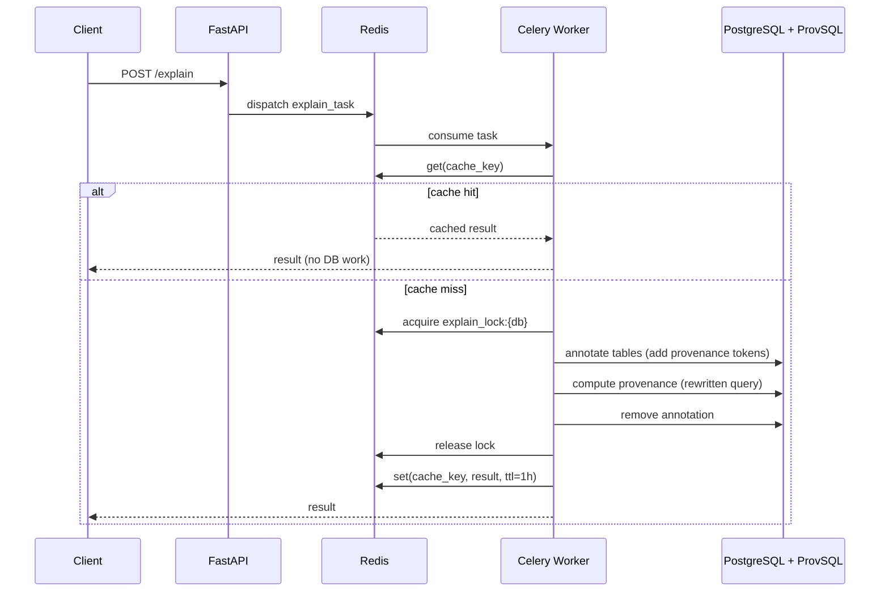

# Service Architecture

The AP Explanation service is a RESTful API designed to annotate SQL queries and explain data provenance using PostgreSQL with the ProvSQL extension. This document outlines the key components and their interactions.

## High-Level Architecture

The AP Explanation service follows a layered architecture:

```
┌─────────────────────────────────────────┐
│       FastAPI REST API Layer            │
│                                         │
└─────────────────┬───────────────────────┘
                  │
┌─────────────────▼───────────────────────┐
│      Business Logic (Services) Layer    │
|                                         |
└─────────────────┬───────────────────────┘
                  │
┌─────────────────▼───────────────────────┐
│    Data Access / Repository Layer       │
|    (Provenance queries and mappings)    |
└─────────────────┬───────────────────────┘
                  │
┌─────────────────▼───────────────────────┐
│    PostgreSQL + ProvSQL Extension       │
└─────────────────────────────────────────┘
```

## Database Requirements

The service has specific database prerequisites:

- **PostgreSQL with ProvSQL Extension**: The underlying database must have the [ProvSQL extension](https://github.com/PierreSenellart/provsql) installed. ProvSQL adds provenance tracking capabilities to PostgreSQL, enabling the tracking of data lineage through SQL queries.

- **Dual Database Architecture**: The service supports connecting to databases across two PostgreSQL instances:
  - **Primary PostgreSQL**: The service first attempts to connect to the database on the primary PostgreSQL server (configured via `POSTGRES_HOST` and `POSTGRES_PORT`)
  - **Timescale Fallback**: If the database doesn't exist on the primary server, it automatically falls back to a Timescale/secondary PostgreSQL server (configured via `POSTGRES_TIMESCALE_HOST` and `POSTGRES_TIMESCALE_PORT`)
  - This architecture enables flexible deployment with databases distributed across multiple instances

- **Dynamic Connection Management**: Connection pools are created per-AP (Analytical Pattern) processing and cleaned up after completion, ensuring efficient resource utilization

- **Automatic Initialization**: When the service connects to the database, it automatically pushes semiring type definitions and related functions. This includes:
  - Custom PostgreSQL types for semiring state management
  - Semiring operation functions (addition, multiplication, monus)
  - Aggregate functions for combining provenance information
  
  This initialization is handled transparently by the repository layer and ensures the database has all necessary provenance tracking infrastructure.

## Core Concepts

### Semiring Annotations

The service supports multiple semiring types for provenance tracking:

- **formula**: Tracks the complete lineage formula showing how results derive from source data
- **why**: Provides why-provenance explaining which source tuples contributed to results

Each semiring has:
- A retrieval function (e.g., `formula`, `whyprov_now`)
- An optional aggregate function
- A mapping table name, that will be the name of the table holding the info about provenance 
- A "mapping strategy". Each row needs to be associated with a unique id to be able to trace back the data. The default mapping uses Postgres ctid to identify each row.

### SQL Rewriting

The `SqlRewriter` class (`internal/sql_rewriter.py`) transforms SQL queries to include provenance tracking:

**Non-aggregate queries:**
```sql
-- Original
SELECT name FROM students WHERE grade > 80

-- Rewritten
SELECT name, whyprov_now(provenance(), 'why_mapping') 
FROM students WHERE grade > 80
```

**Aggregate queries:**
```sql
-- Original
SELECT department, COUNT(*) FROM employees GROUP BY department

-- Rewritten (wraps as subquery)
SELECT department, COUNT(*), 
       aggregation_formula(prov_agg, 'formula_mapping')
FROM (SELECT department, COUNT(*) as cnt, 
             provenance() as prov_agg
      FROM employees GROUP BY department) AS subquery
```


## Limitations and Known Issues

### SQL Support
- **Query types**: Only `SELECT` queries are supported
- **HAVING clause**: Not currently supported in query rewriting

### Mapping Strategy
- Currently uses PostgreSQL `ctid` (row identifier)
- `ctid` can change on VACUUM FULL operations

## Key Design Patterns

### Explain Request Flow

The following sequence diagram shows what happens end-to-end when a client requests a provenance explanation.



Key points:
- The **cache** (Redis) is checked first — identical requests are served without touching the database.
- The **distributed lock** ensures only one task runs against a given database at a time, preventing annotation conflicts.
- **Annotation** adds ProvSQL provenance tokens to the target tables, **computation** runs the rewritten query, and **removal** cleans up the tokens afterwards.

### Dependency Injection

The service uses a DI container (defined in `di.py`) to manage dependencies:
- **Dynamic Service Creation**: Service instances are created per-AP processing request using a factory function (`get_provenance_service_for_ap`)
- **Connection Pool Management**: Connection pools are created when an AP is processed and cleaned up after completion
- **Database Routing**: The DI system handles automatic routing between primary PostgreSQL and Timescale instances
- **Repository Layer**: Repositories are created with database connections from the appropriate pool
- Enables easier testing and component isolation