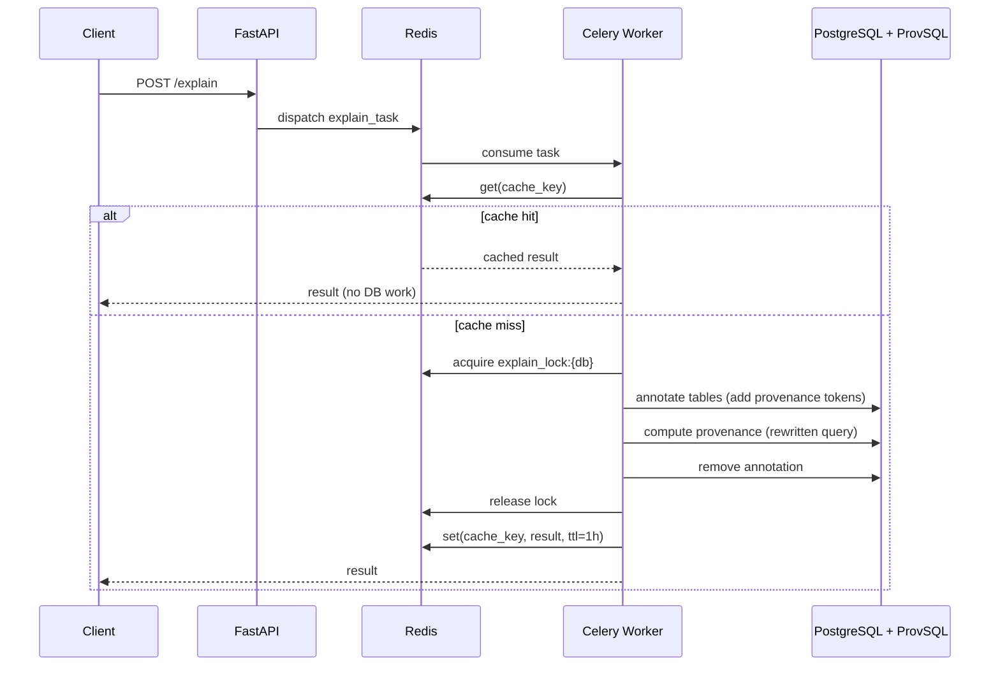

# Service Architecture

The AP Explanation service is a RESTful API designed to annotate SQL queries and explain data provenance using PostgreSQL with the ProvSQL extension. This document outlines the key components and their interactions.

## High-Level Architecture

The AP Explanation service follows a layered architecture:

```
┌─────────────────────────────────────────┐
│       FastAPI REST API Layer            │
│                                         │
└─────────────────┬───────────────────────┘
                  │
┌─────────────────▼───────────────────────┐
│      Business Logic (Services) Layer    │
|                                         |
└─────────────────┬───────────────────────┘
                  │
┌─────────────────▼───────────────────────┐
│    Data Access / Repository Layer       │
|    (Provenance queries and mappings)    |
└─────────────────┬───────────────────────┘
                  │
┌─────────────────▼───────────────────────┐
│    PostgreSQL + ProvSQL Extension       │
└─────────────────────────────────────────┘
```

## Database Requirements

The service has specific database prerequisites:

- **PostgreSQL with ProvSQL Extension**: The underlying database must have the [ProvSQL extension](https://github.com/PierreSenellart/provsql) installed. ProvSQL adds provenance tracking capabilities to PostgreSQL, enabling the tracking of data lineage through SQL queries.

- **Dual Database Architecture**: The service supports connecting to databases across two PostgreSQL instances:
  - **Primary PostgreSQL**: The service first attempts to connect to the database on the primary PostgreSQL server (configured via `POSTGRES_HOST` and `POSTGRES_PORT`)
  - **Timescale Fallback**: If the database doesn't exist on the primary server, it automatically falls back to a Timescale/secondary PostgreSQL server (configured via `POSTGRES_TIMESCALE_HOST` and `POSTGRES_TIMESCALE_PORT`)
  - This architecture enables flexible deployment with databases distributed across multiple instances

- **Dynamic Connection Management**: Connection pools are created per-AP (Analytical Pattern) processing and cleaned up after completion, ensuring efficient resource utilization

- **Data Source Types**: The service supports two data source types:
  - **Relational Database** (`RelationalDbDataSource`): connects to existing PostgreSQL tables
  - **CSV Set** (`CsvSetDataSource`): loads CSV files into a temporary schema in a `playground` database, runs provenance, then drops the schema

- **Automatic Initialization**: When the service connects to the database, it automatically sets up per-table provenance side tables and the union mapping table for each active semiring. No custom PostgreSQL functions are installed — all provenance computation relies on ProvSQL's compiled built-in `sr_*` functions.

## Core Concepts

### Semiring Annotations

The service supports the following ProvSQL built-in semirings, all defined in `ap_explanation/semirings.py`:

| Name | ProvSQL function | Description |
|---|---|---|
| `formula` | `sr_formula` | Algebraic expression showing how results derive from source data |
| `why` | `sr_why` | Lists source tuples that contributed to each result row |
| `boolexpr` | `sr_boolexpr` | Boolean provenance expression over source identifiers |
| `how` | `sr_how` | How-provenance: multiset polynomial showing multiplicities |
| `which` | `sr_which` | Which-provenance (lineage): set of contributing tuple identifiers |

Each semiring has:
- A **retrieval function** — one of ProvSQL's compiled `sr_*` functions, typed as `ANYELEMENT` so it works for both plain and aggregate provenance tokens without a separate aggregate function.
- A **mapping table name** — the table that maps provenance tokens to source row labels, rebuilt as a UNION of all per-table provenance tables before each query.
- A **mapping strategy** — `CtidMapping` by default, which labels each row as `table@ctid` using the PostgreSQL physical row identifier.

### SQL Rewriting

The `SqlRewriter` class (`internal/sql_rewriter.py`) transforms SQL queries to include provenance tracking:

**Non-aggregate queries:**
```sql
-- Original
SELECT name FROM students WHERE grade > 80

-- Rewritten (e.g. with sr_why)
SELECT name, sr_why(provenance(), 'why_mapping')
FROM students WHERE grade > 80
```

**Aggregate queries** — wrapped as a subquery so ProvSQL can capture the aggregate token:
```sql
-- Original
SELECT department, COUNT(*) FROM employees GROUP BY department

-- Rewritten (e.g. with sr_formula)
SELECT x.department, sr_formula(x.cnt, 'formula_mapping')
FROM (
    SELECT department, COUNT(*) AS cnt
    FROM employees GROUP BY department
) AS x
```

All `sr_*` functions are `ANYELEMENT` polymorphic — the same function name is used for both plain provenance tokens (`provenance()`) and aggregate tokens, so no separate aggregate function is needed.


## Limitations and Known Issues

### SQL Support
- **Query types**: Only `SELECT` queries are supported
- **HAVING clause**: Not currently supported in query rewriting

### Mapping Strategy
- Currently uses PostgreSQL `ctid` (row identifier)
- `ctid` can change on VACUUM FULL operations

## Key Design Patterns

### Explain Request Flow

The following sequence diagram shows what happens end-to-end when a client requests a provenance explanation.



Key points:
- The **cache** (Redis) is checked first — identical requests are served without touching the database.
- The **distributed lock** ensures only one task runs against a given database at a time, preventing annotation conflicts.
- **Annotation** adds ProvSQL provenance tokens to the target tables, **computation** runs the rewritten query, and **removal** cleans up the tokens afterwards.

### Caching and Locking

- **Redis Cache** (`RedisCacheProvider`): Results are cached under a SHA-256 key derived from all input parameters. Cache hits skip the database entirely. Default TTL is 1 hour.
- **Distributed Lock** (`RedisLockProvider`): A per-database Redis lock (`explain_lock:{db_name}`) ensures only one explain task runs against a given database at a time, preventing annotation conflicts.

### Dependency Injection

The service uses a DI container (defined in `di.py`) to manage dependencies:
- **Dynamic Service Creation**: Service instances are created per-AP processing request using a factory function (`get_provenance_service_for_ap`)
- **Connection Pool Management**: Connection pools are created when an AP is processed and cleaned up after completion
- **Database Routing**: The DI system handles automatic routing between primary PostgreSQL and Timescale instances
- **Repository Layer**: Repositories are created with database connections from the appropriate pool
- Enables easier testing and component isolation